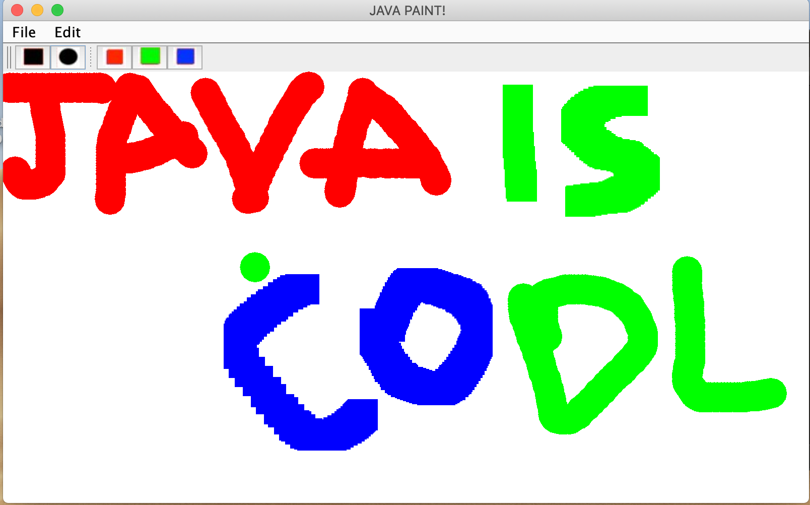

= Hangman

* This small app was developed in Java with the IDE Eclipce. 
* This is a mini application similar to a drawing slate.

== How to run the application?

* In the IDE: find `Main.java`, right-click project, select "Run As > Java Application"
* From the command line: run `java -jar jpaint.jar`

